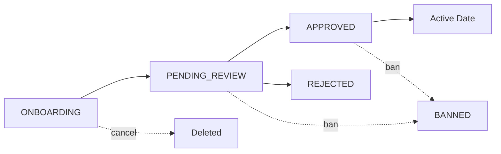

The jøsh admin interface provides centralized management for the entire dating service workflow, from user onboarding through active date monitoring.

## Accessing the Admin Panel

The admin interface is located at `/backend` and requires authentication:

<Steps>
  <Step title="Navigate to admin panel">
    Visit `/backend` in your browser
  </Step>
  
  <Step title="Enter admin API key">
    Enter your admin API key (stored securely as `x-internal-api-key`)
  </Step>
  
  <Step title="Access granted">
    The key is saved in localStorage for persistent access
  </Step>
</Steps>

<Warning>
  Admin API keys grant full access to user data and actions. Protect these credentials carefully and never commit them to version control.
</Warning>

## Admin Tabs

The admin interface is organized into four primary tabs:

<CardGroup cols={2}>
  <Card title="Onboarding" icon="user-plus">
    Monitor users currently in the onboarding flow. Send reminders, restart flows, or cancel incomplete signups.
  </Card>
  
  <Card title="Applications" icon="clipboard-check">
    Review pending user applications with status `PENDING_REVIEW`. Approve or reject based on profile completeness and quality.
  </Card>
  
  <Card title="Pairing" icon="users">
    Create matches between approved users. View and manage active dates, monitor conversations.
  </Card>
  
  <Card title="Demo" icon="calendar">
    Test the scheduling simulator for date coordination workflows.
  </Card>
</CardGroup>

## User Status Lifecycle

Users progress through these statuses:



### Status Definitions

| Status | Description | Admin Actions |
|--------|-------------|---------------|
| `ONBOARDING` | User completing initial questions and photo submission | Restart, Cancel, Ping |
| `PENDING_REVIEW` | Awaiting admin approval after onboarding complete | Approve, Reject, Ban, Delete |
| `APPROVED` | Ready for pairing | Pair, Ban, Delete |
| `REJECTED` | Application denied | Delete (allows re-signup) |
| `BANNED` | Permanently blocked | Delete (allows re-signup) |

## Key Features

### Structured Profile Badges

The admin interface displays user profiles as **structured badges** extracted from conversational onboarding responses. These badges are categorized into:

- **About badges**: Personal attributes (gender, age, hobbies, lifestyle, work)
- **Preference badges**: Partner preferences (age range, dealbreakers, must-haves)

Admins can edit or delete individual badges to refine profile accuracy.

### Real-time Counts

Tab badges show live counts that refresh every 30 seconds:
- Onboarding users
- Pending applications
- Approved users available for pairing
- Blocked users (banned + rejected)

### Photo Gallery

Secure photo viewing with:
- Thumbnail gallery navigation
- Click to expand full-size images
- ID photo verification display

## API Authentication

All admin API routes require the `x-internal-api-key` header:

```typescript
fetch('/api/tpo/admin/users?status=APPROVED', {
  headers: { 'x-internal-api-key': apiKey }
})
```

## Next Steps

<CardGroup cols={2}>
  <Card title="Review Applications" href="/admin-guide/user-review" icon="clipboard-check">
    Learn how to approve and reject user applications
  </Card>
  
  <Card title="Create Pairings" href="/admin-guide/pairing" icon="users">
    Guide to matching approved users
  </Card>
  
  <Card title="Monitor Dates" href="/admin-guide/monitoring" icon="messages">
    Track conversations and date progress
  </Card>
</CardGroup>