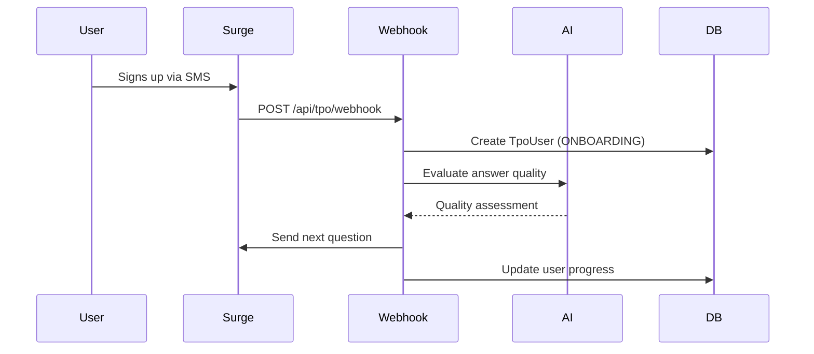
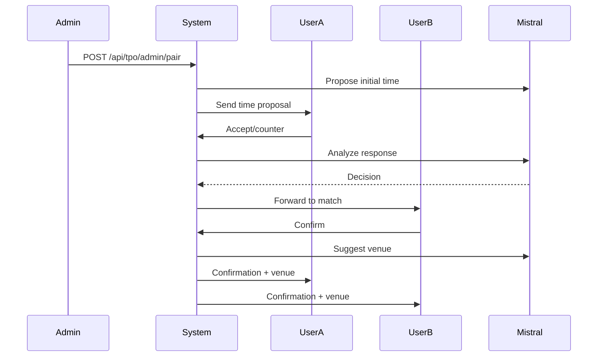

## Overview

jøsh is a Next.js 15 full-stack application that handles SMS-based dating through a sophisticated onboarding, matching, and scheduling system.

## Technology Stack

### Core Framework
- **Next.js 15** - React framework with App Router
- **React 18.3** - UI library
- **TypeScript 5** - Type-safe development
- **Tailwind CSS 3.4** - Utility-first styling

### Backend
- **Prisma 6.3** - Database ORM
- **PostgreSQL** - Primary database (via Prisma)
- **tRPC 11** - End-to-end typesafe APIs
- **Zod 3.25** - Runtime validation

### External Services
- **Surge API** - SMS communication gateway
- **Supabase** - File storage for photos and ID verification
- **AI Gateway** - Unified AI API access

### AI Models
- **Mistral Medium** - Date scheduling and venue suggestions
- **GPT-4o-mini** - Profile structuring and onboarding

### Key Dependencies
```json
{
  "@ai-sdk/openai": "^3.0.33",
  "@prisma/client": "^6.3.1",
  "@supabase/supabase-js": "^2.48.1",
  "@tanstack/react-query": "^5.64.2",
  "@trpc/client": "11.0.0-rc.502",
  "ai": "^6.0.99",
  "axios": "^1.7.9",
  "sharp": "^0.34.5"
}
```

## Architecture Layers

### 1. Presentation Layer
- Next.js App Router pages
- React components with TypeScript
- TanStack Query for state management
- React Virtual for performance optimization

### 2. API Layer
- **REST Routes** - SMS webhooks, signup, admin operations
- **tRPC Routes** - Type-safe client-server communication
- Internal API authentication via header keys

### 3. Business Logic Layer
- **Onboarding Flow** - Multi-step SMS-based user intake
- **Scheduling Engine** - AI-powered date coordination
- **Message Relay** - Portal-based communication between matches
- **Profile Structuring** - AI-based user profile extraction

### 4. Data Layer
- Prisma ORM with PostgreSQL
- Schema-driven models with relationships
- Direct database URL for migrations
- Supabase Storage for media assets

## System Flow

### User Onboarding


### Date Scheduling


## AI Integration Points

### 1. Profile Structuring (GPT-4o-mini)
**Location**: `src/lib/profileStructuring.ts:338`

Converts free-form onboarding responses into structured JSON with 25+ fields across "about" and "preferences" sections.

```typescript
const { text } = await generateText({
  model: "openai/gpt-4o-mini",
  prompt: `Convert this dating onboarding profile into structured JSON...
  Name: ${input.dlName}
  Age: ${input.dlAge}
  About: ${input.aboutMe}
  Preferences: ${input.preferences}`,
  maxOutputTokens: 700,
});
```

### 2. Scheduling Analysis (Mistral Medium)
**Location**: `src/lib/tpoScheduling.ts:119`

Analyzes user messages to determine acceptance, counter-proposals, or need for clarification.

```typescript
const { text } = await generateText({
  model: "mistral/mistral-medium",
  prompt: `Analyze user's scheduling response...
  Today: ${todayStr}
  Proposed time: ${proposedSlot}
  Conversation: ${conversationText}`,
  maxOutputTokens: 160,
});
```

### 3. Venue Suggestion (Mistral Medium)
**Location**: `src/lib/tpoScheduling.ts:239`

Suggests real, specific date venues based on user profiles and agreed time.

```typescript
const { text } = await generateText({
  model: "mistral/mistral-medium",
  prompt: `Suggest a first date venue...
  City: ${city}
  Person A: ${profileSummary(userAProfile)}
  Person B: ${profileSummary(userBProfile)}`,
  maxOutputTokens: 80,
});
```

## Storage Architecture

### Database (PostgreSQL via Prisma)
- User profiles and status tracking
- Date records and scheduling state
- Message history and blocking flags
- Photo metadata and ELO ratings

### File Storage (Supabase)
- **Bucket**: `tpo-uploads` (configurable)
- **Photos**: `photos/{phoneNumber}/{timestamp}.jpg`
- **IDs**: `ids/{phoneNumber}/{timestamp}.jpg`
- Images compressed to 1600px max, 70% quality
- Signed URLs with 1-hour expiry
- Transform options: thumbnail (400x400) or full (1200px)

## Security

### Authentication
- **Webhook validation**: Surge signature verification
- **Admin API**: Internal API key header (`x-internal-api-key`)
- **Supabase**: Service role key for server-side operations

### Content Safety
- Profanity filter on message relay
- Blocked word detection and sanitization
- Message blocking flags in database

### Data Protection
- Phone numbers validated as E.164 format
- Driver's license data extraction (non-blocking)
- User banning system with cascade cleanup

## Deployment

### Environment Variables
```bash
DATABASE_URL          # PostgreSQL connection
DIRECT_URL            # Direct database access
SURGE_API_KEY         # SMS provider
SURGE_WEBHOOK_SECRET  # Webhook signature validation
SUPABASE_PROJECT_URL  # Storage service
SUPABASE_SERVICE_ROLE_KEY
AI_GATEWAY_API_KEY    # AI model access
INTERNAL_API_KEY      # Admin API auth
```

### Build Process
```bash
npm run vercel-build  # Generates Prisma client + Next.js build
```

## Performance Optimizations

- **Image Compression**: Sharp processing to JPEG at 70% quality
- **React Virtual**: Virtualized lists for large datasets
- **Parallel Queries**: Promise.all for independent operations
- **Timeouts**: 20s limit on AI operations to prevent blocking
- **Signed URL Caching**: 1-hour expiry reduces storage requests

## Error Handling

- **Graceful Degradation**: AI failures fall back to static responses
- **Non-blocking Operations**: Photo tag extraction won't halt onboarding
- **Retry Logic**: Venue suggestion retries once if too generic
- **Comprehensive Logging**: Console logging for debugging webhook flows

## Related Documentation

<CardGroup cols={2}>
  <Card title="Database Schema" icon="database" href="/technical/database-schema">
    Complete Prisma schema with all models and relationships
  </Card>
  <Card title="API Endpoints" icon="code" href="/technical/api-endpoints">
    REST API reference for all TPO endpoints
  </Card>
</CardGroup>